# 🏭 Material Requirements Planning (MRP)

Enterprise-grade full-stack application for managing **inventory, production planning, and procurement workflows**.

## ✨ Overview

This project implements a **Material Requirement Planning (MRP) system** similar to real-world manufacturing software.
It integrates **inventory tracking, BOM management, production execution, and analytics** into a single platform.

## 🚀 Core Features

* **Inventory Management** — Track materials, stock levels, and suppliers
* **BOM (Bill of Materials)** — Define product structures with cost calculation
* **Production Planning** — Compute required materials & detect shortages
* **Purchase Orders** — Manage procurement lifecycle and stock updates
* **Stock Movements** — Full audit of IN / OUT inventory changes
* **Dashboard Analytics** — Real-time insights and alerts
* **Role-Based Access Control** — Admin & Staff permissions
* **Predictive Insights** — Smart estimation of shortages and coverage
* **Report Export** — Generate PDF & Excel reports
* **Real-time Updates** — Live sync using Socket.IO

## 🧱 Tech Stack

**Frontend**

* React + TypeScript + Vite
* Tailwind CSS

**Backend**

* Node.js + Express
* REST APIs

**Database**

* MongoDB (Mongoose)

**Realtime**

* Socket.IO

## 📁 Project Structure

.
├── src/        # Frontend (React)
├── server/     # Backend (Express API)
└── README.md

## ⚙️ Getting Started

### 1. Clone

git clone https://github.com/<your-username>/Material-Requirement-Planning-MRP.git
cd Material-Requirement-Planning-MRP

### 2. Install

```
npm install
cd server && npm install
```

### 3. Environment

Create `server/.env`:

MONGO_URI=your_mongodb_connection_string
PORT=5000

### 4. Run

```
# backend
cd server && npm start

# frontend
npm run dev
---

## 🔌 API (Sample)

GET    /api/materials
POST   /api/bom
POST   /api/po
GET    /api/dashboard/stats

## 🧠 Design Highlights

* Modular backend with scalable API structure
* Event-driven updates via WebSockets
* Clean separation of frontend & backend
* Real-world MRP workflow simulation


## 📸 Screenshots

### 🏠 Landing Page


### 🎯 Landing UI Variations
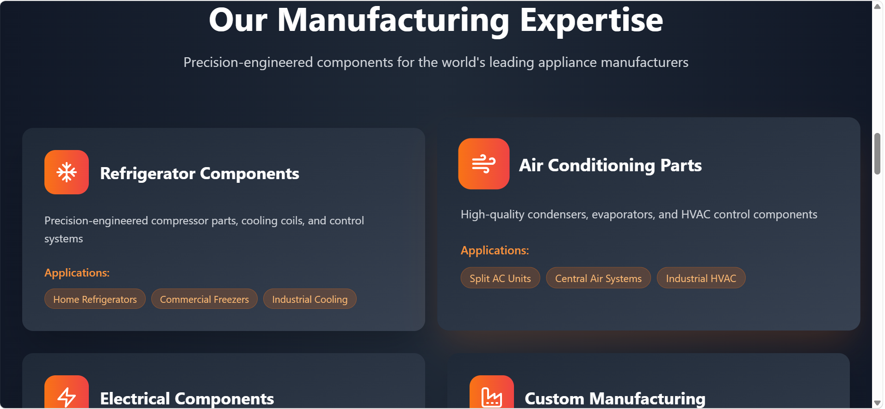
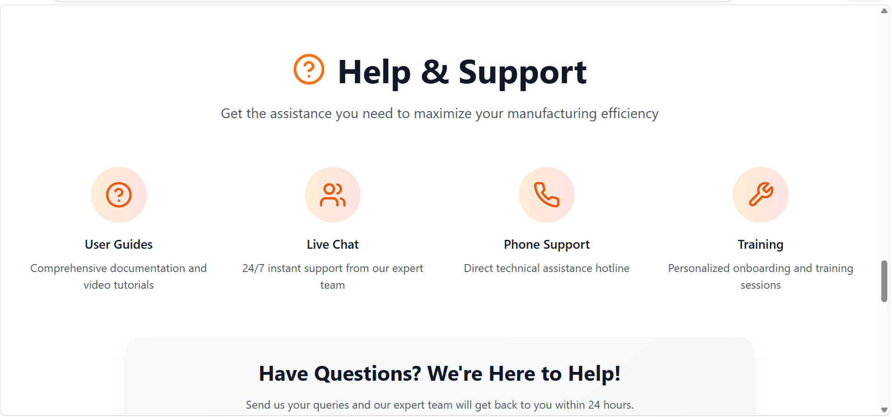

### 🔐 Login Page
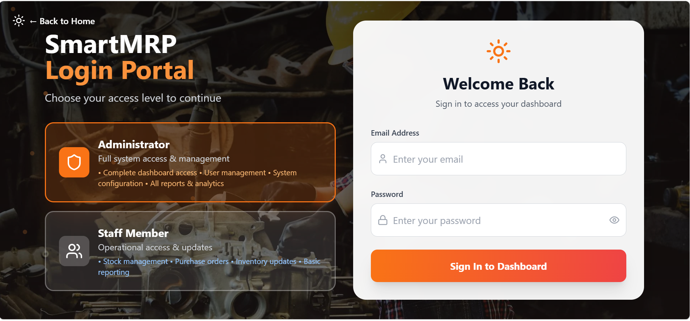

### 📊 Dashboard Overview
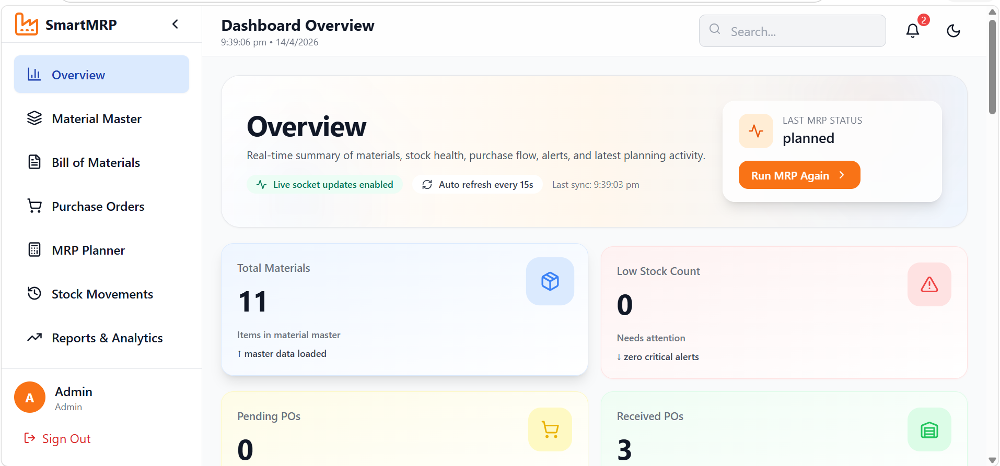

### 🏭 MRP Planner
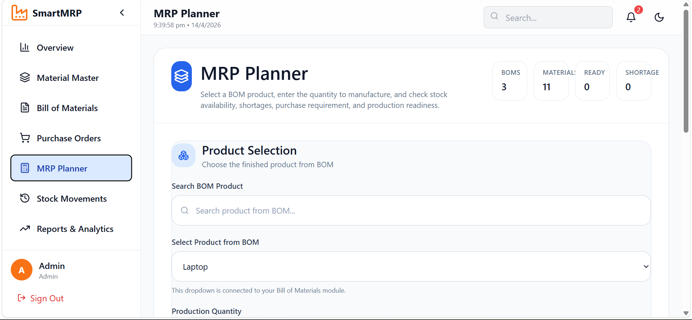
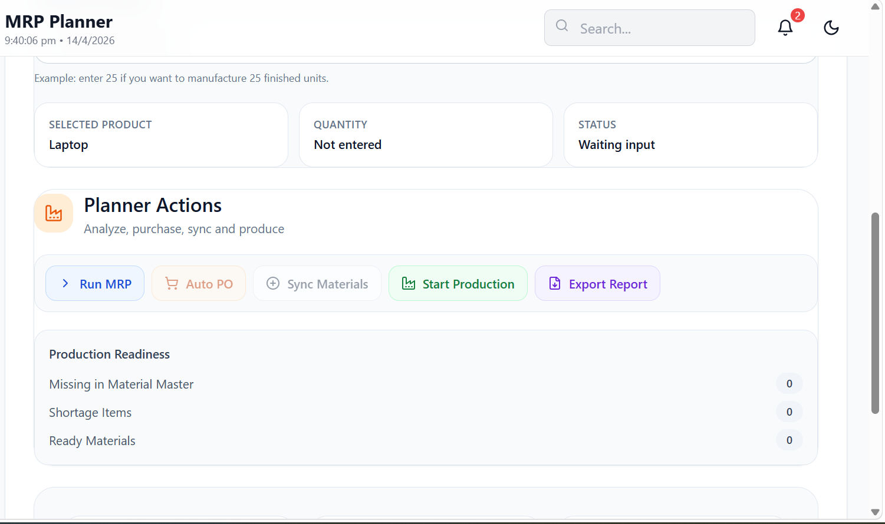

### 📦 Bill of Materials (BOM)
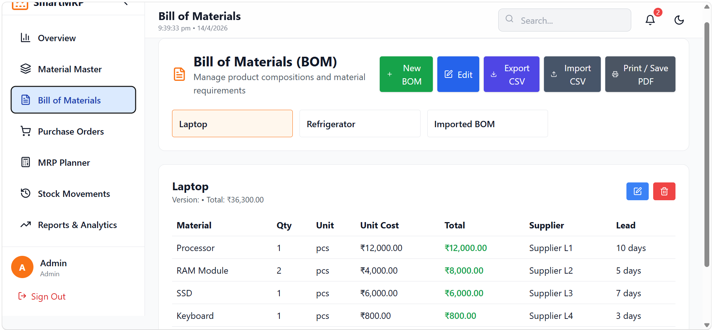

### 📋 Material Master
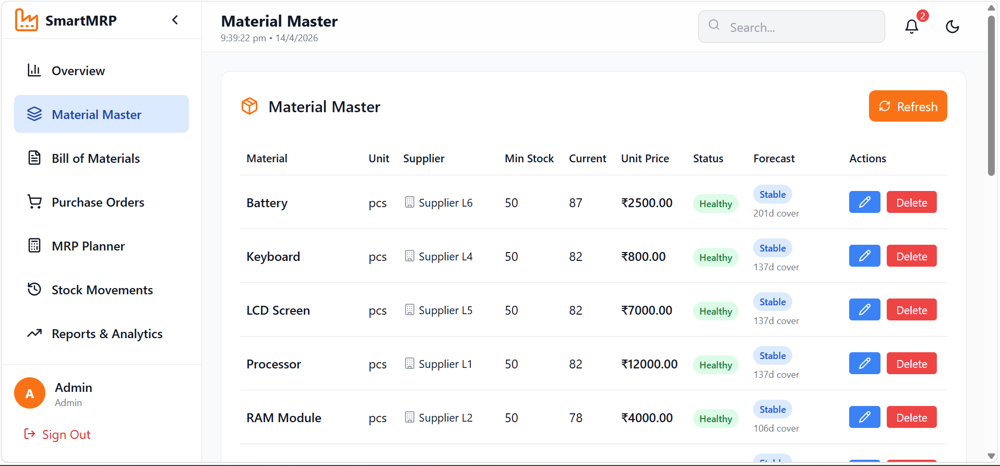

### 🛒 Purchase Order Management
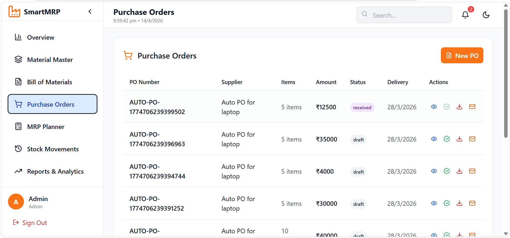

### 📈 Reports & Analytics
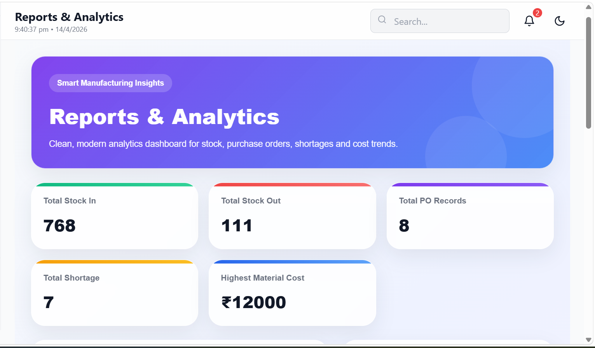
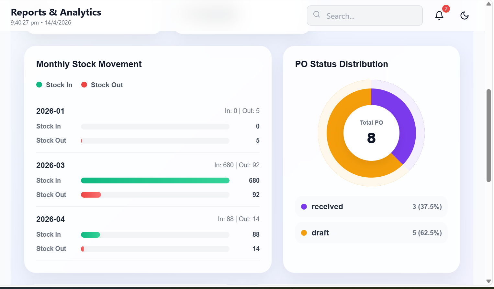

### 🔄 Stock Movements Tracking
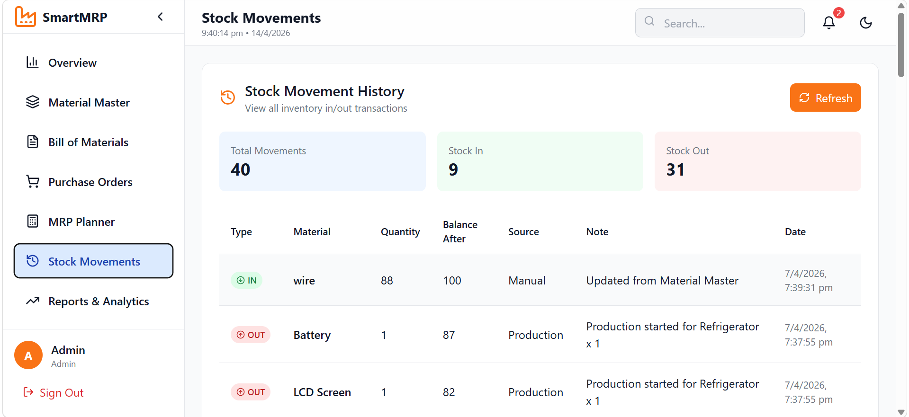

### 🗄️ Database (MongoDB Collections)
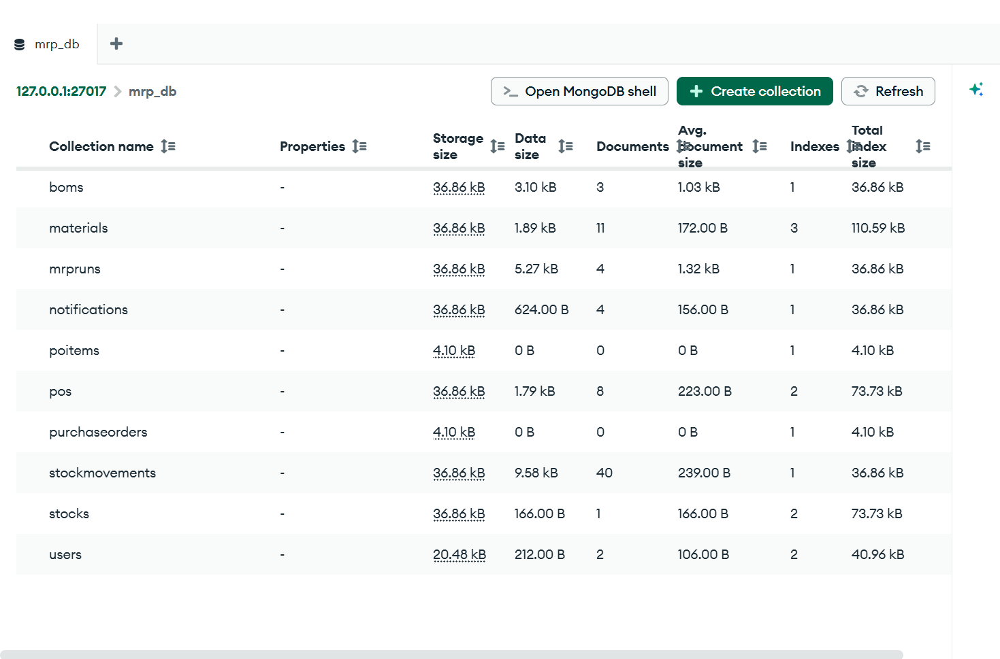

## ⭐
If you found this useful, consider starring the repo.
